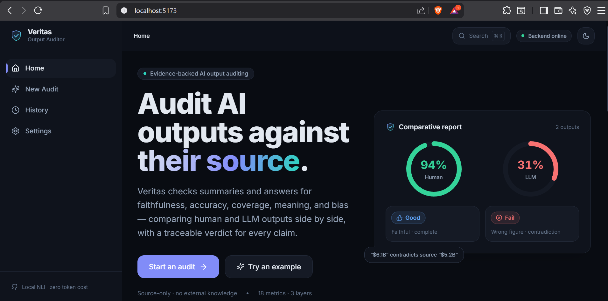
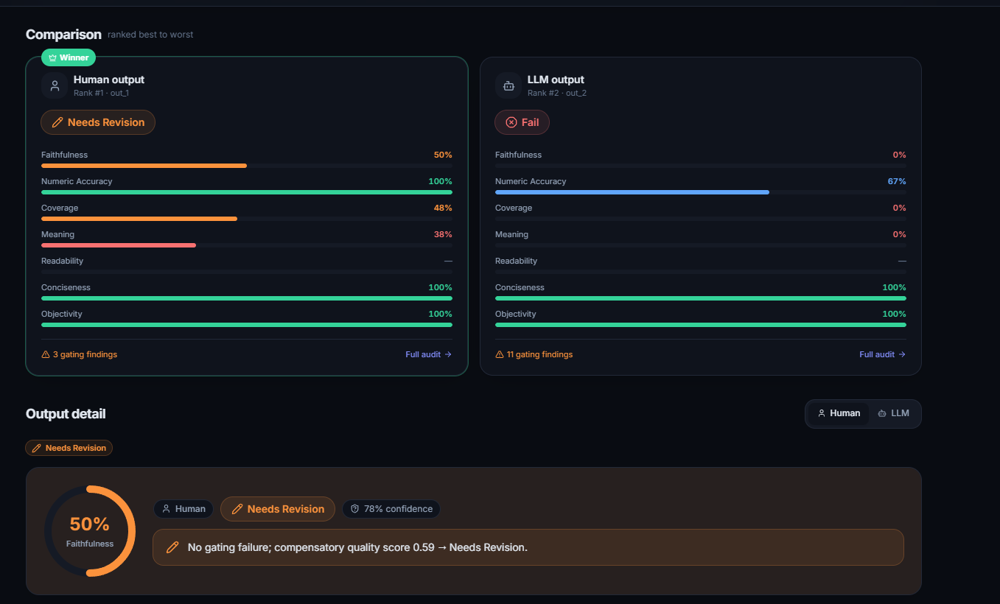
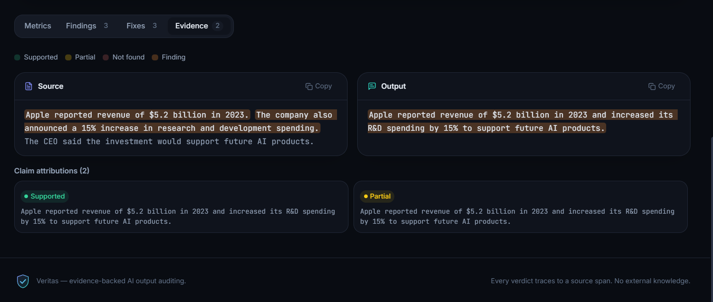
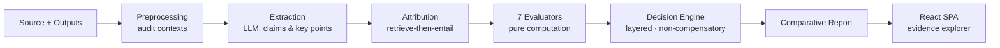

<div align="center">

# Veritas

### Evidence-backed auditing for AI-generated content.

Veritas audits one or more AI- or human-written **outputs** against a single **source article** and returns a comparative, evidence-backed report: which output is more trustworthy, *why*, and *what to fix*. Every verdict traces back to a specific source span — no external knowledge, no vibes. It exists because fluent text is easy and *correct* text is hard, and it's built for anyone shipping, reviewing, or researching LLM output who needs more than a gut feeling.

<br />


</div>

<br />

---

## 📸 Screenshots

> _Add screenshots to `docs/images/` — the sections below are wired up and ready._

### Dashboard


### Comparative Report


### Evidence Viewer


<br />

---

## 🤔 Why Veritas?

As AI-generated text floods every workflow, the hard problem is no longer *producing* content — it's **knowing which output to trust**.

The catch: **fluent does not mean correct.** A confident, well-written paragraph can still:

- 🌫️ **Hallucinate** facts that never appeared in the source
- 🔢 **Misquote a figure** — turning `$5.2B` into `$5.2M`
- 🕳️ **Drop the one critical fact** the reader actually needed
- 🎭 **Editorialize** — sliding opinion in where the source was neutral

Standard summarization scorers reward what *reads* well. Veritas asks a stricter question: **is every claim actually supported by the source?** It extracts the claims, retrieves the evidence, and grades each output against the text it was supposed to be faithful to — then ranks them side by side with a transparent, defensible verdict.

<br />

---

## ✨ Key Features

| | |
|---|---|
| 🔍 **Evidence-backed auditing** | Every verdict links to the exact source span behind it |
| ⚖️ **Comparative evaluation** | Rank N outputs side-by-side and name a clear winner |
| 🧷 **Grounded fact verification** | Retrieve-then-entail: claims checked against source, not world knowledge |
| 🌫️ **Hallucination detection** | Flags unsupported and contradicted claims |
| 📊 **Coverage analysis** | Surfaces missing critical facts |
| 🔁 **Meaning preservation** | Detects distortion, not just word overlap |
| 🔢 **Numeric accuracy validation** | Deterministic checking of figures and units |
| 🎯 **Confidence scoring** | Every verdict carries a calibrated confidence |
| 💬 **Explainable verdicts** | Human-readable findings + concrete fixes |
| 🖥️ **Interactive dashboard** | Premium React SPA with a synchronized evidence explorer |
| 📎 **Multi-format ingestion** | Audit `txt` · `md` · `html` · `pdf` sources |
| 🐳 **Docker support** | Full stack up with one command |
| 🔌 **REST API** | Clean, typed FastAPI surface |

<br />

---

## 🔄 Demo Workflow

```text
        Source Article
              │
              ▼
      Multiple AI Outputs
              │
              ▼
       Claim Extraction        ← LLM (scarce budget spent only here)
              │
              ▼
      Evidence Retrieval        ← local embeddings, zero token cost
              │
              ▼
       Grounding + NLI          ← local cross-encoder, CPU, $0
              │
              ▼
      Layered Evaluation        ← non-compensatory decision engine
              │
              ▼
      Comparative Report
```

<br />

---

## 🏗️ Architecture

Veritas spends the expensive LLM budget **only where a model is genuinely needed** (claim & key-point extraction). Everything else — retrieval, entailment, numeric checks, bias — runs **locally and deterministically**, so audits are cheap and reproducible.



**Grounding, in detail.** A local NLI cross-encoder (`cross-encoder/nli-deberta-v3-base`) retrieves candidate source spans for each output claim and labels every one `supported` / `neutral` / `contradicted` — on CPU, at **zero token cost**. Numeric accuracy, conciseness, and bias are fully deterministic. The LLM never sees a scoring decision; it only extracts.

<br />

---

## 🧰 Technology Stack

| Layer | Technology |
|---|---|
| **Frontend** | React 18 · TypeScript (strict) · Vite 5 · Tailwind CSS · Framer Motion · lucide-react |
| **Backend** | Python · FastAPI · Pydantic v2 · Uvicorn |
| **Embeddings** | Sentence-Transformers (local, lazy-loaded) |
| **NLI / Grounding** | `cross-encoder/nli-deberta-v3-base` (DeBERTa-v3, local, CPU) |
| **LLM Provider** | Groq (default) · OpenRouter — used only for extraction |
| **Infrastructure** | Docker · Docker Compose · nginx (frontend proxy) |

<br />

---

## 🚀 Quick Start

### 🐳 With Docker (recommended)

```bash
cp backend/.env.example backend/.env      # add your GROQ_API_KEY
docker compose up --build
```

| Service | URL |
|---|---|
| Frontend | http://localhost:5173 |
| Backend (Swagger) | http://localhost:8000/docs |

> The first build installs `torch` and bakes in the embedding + NLI models — expect a few minutes. Every build after that is cached.

### 💻 Local development

```bash
# Backend — from repo root
cd backend
python -m venv .venv && source .venv/bin/activate
pip install -r requirements.txt
python -m uvicorn app.main:app --port 8001      # matches the Vite dev proxy
```

```bash
# Frontend — in a second terminal
cd frontend
npm install
npm run dev                                     # http://localhost:5173
```

> **No `GROQ_API_KEY`?** The stack still runs. `/health` reports `llm_configured: false`, claim extraction degrades, and audits return *Unable to Verify* — the honest verdict for a system that couldn't check anything. Local NLI grounding and the deterministic checks run regardless.

<br />

---

## 🔌 API

| Method | Path | Purpose |
|---|---|---|
| `POST` | `/audit/outputs` | Audit `{ source, outputs[] }` → `ComparativeReport` (synchronous) |
| `GET` | `/health` | Liveness/readiness: provider, model availability, `nli_ready` |

```jsonc
// POST /audit/outputs
{
  "source": { "text": "The company reported revenue of $5.2 billion in 2023. …" },
  "outputs": [
    { "producer": "human", "output_type": "summary", "text": "…" },
    { "producer": "llm",   "output_type": "summary", "text": "…" }
  ]
}
```

The response is a `ComparativeReport`: per-output `OutputAudit` (verdict, layered metric results, findings, recommendations, confidence, attribution map) plus a ranked `Comparison`. Full schema in [`backend/app/shared/schemas.py`](backend/app/shared/schemas.py).

<br />

---

## 📁 Project Structure

```text
backend/app/
├── core/            config · logging · errors · metric matrix
├── shared/          LLM · embeddings · NLI · retrieval · evidence · extraction · schemas
├── attribution/     retrieve-then-entail grounding substrate
├── evaluators/      the 7 metric evaluators (pure computation units)
├── orchestration/   Audit Orchestrator · layered Decision Engine · report assembly
├── preprocessing/   {source, outputs[]} → audit contexts (txt · md · html · pdf)
└── api/             FastAPI surface (/audit/outputs, /health)

config/
├── settings.yaml    thresholds & weights (all tunables)
└── prompts/         the 3 LLM prompt templates (claim & key-point extraction, salience)

frontend/            Veritas — the React SPA (see frontend/README.md)
```

<br />

---

## 🧪 Evaluation Framework

Veritas evaluates each output across **three layers**. The framework is **non-compensatory**: a grounding failure *caps* the verdict no matter how polished the writing is. You cannot write your way out of being wrong.

| Layer | Role | Metrics |
|---|---|---|
| **1 · Grounding** | 🔴 Gating (non-compensatory) | Faithfulness · Numeric Accuracy · Hallucinations · Unsupported Claims · Contradictions |
| **2 · Information Quality** | 🟡 Partial gating | Coverage · Missing Critical Facts · Meaning Preservation |
| **3 · Presentation** | 🟢 Compensatory | Readability · Conciseness · Bias / Objectivity |

**Why non-compensatory?** Because trust doesn't average. An output that reads beautifully but invents a statistic is *more* dangerous than a clumsy-but-accurate one — the fluency makes the error persuasive. So Layer 1 gates: if grounding fails, no amount of Layer 3 polish can lift the verdict.

Each output receives one verdict — **Excellent · Good · Needs Revision · Fail · Unable to Verify** — and outputs are ranked head-to-head with a clear winner.

<br />

---

## 📋 Example Audit Result

An illustrative comparison of two summaries of the same source:

```text
  SOURCE  "…reported revenue of $5.2 billion in 2023, up 14% year over year…"

┌──────────────────────────────────────────────────────────────────────┐
│  Output A  (llm)                                    🏆 WINNER          │
│  ───────────────────────────────────────────────────────────────────  │
│  Faithfulness ........ ████████████████████░  0.94   ✅ grounded        │
│  Coverage ............ ██████████████████░░░  0.88   ✅ key facts kept   │
│  Meaning ............. ███████████████████░░  0.91   ✅ preserved        │
│  Verdict ............. GOOD                                             │
└──────────────────────────────────────────────────────────────────────┘

┌──────────────────────────────────────────────────────────────────────┐
│  Output B  (llm)                                                       │
│  ───────────────────────────────────────────────────────────────────  │
│  Faithfulness ........ █████████░░░░░░░░░░░░  0.41   ❌ "$5.2 million"   │
│  Coverage ............ ████████████████░░░░░  0.79   ⚠  dropped growth   │
│  Meaning ............. ██████████████░░░░░░░  0.70   ⚠  distorted        │
│  Verdict ............. NEEDS REVISION                                   │
└──────────────────────────────────────────────────────────────────────┘

  FINDING   Output B states "$5.2 million" — the source says "$5.2 billion".
            Numeric contradiction → grounding capped → verdict gated.
```

_Numbers are illustrative. In the app, every metric expands to the exact source spans behind it._

<br />

---

## 🗺️ Roadmap

- [ ] 📄 **PDF export** of comparative reports
- [ ] 🔌 **Additional LLM providers** for extraction
- [ ] 📚 **Multi-document auditing** (source sets, not just one article)
- [ ] ⚙️ **Batch processing** for large output sets
- [ ] 🎚️ **Custom evaluation metrics** via config

<br />

---

## 💡 Why Veritas Is Different

Most "summary scorers" reward text that *looks* right. Veritas is built to catch text that *is* wrong.

| | Simple summarization evaluators | **Veritas** |
|---|---|---|
| **Evidence tracing** | ❌ Opaque scores | ✅ Every verdict → source span |
| **Grounding** | ❌ Rewards fluency / overlap | ✅ Retrieve-then-entail against source |
| **Comparison** | ❌ One output at a time | ✅ Ranked head-to-head, clear winner |
| **Reasoning** | ❌ Black-box number | ✅ Findings + concrete fixes |
| **Decision model** | ❌ Weighted average | ✅ Layered · non-compensatory gating |
| **Cost** | 💸 Token-heavy | ✅ LLM only for extraction; rest is local & deterministic |

<br />

---

## ⚙️ Configuration

All tunables live in [`config/settings.yaml`](config/settings.yaml); secrets and per-deployment overrides come from `backend/.env` (see `.env.example`). The environment always wins over YAML.

- `nli.model` / `nli.entail_threshold` — the grounding backbone
- `attribution.top_k` / `contradiction_threshold` — retrieval + NLI dials
- `verdict.*` — verdict bands, minimum grounding confidence, per-metric weights
- `numeric.*` · `coverage.*` · `meaning.*` · `bias.*` — per-evaluator thresholds

Provider keys are per-provider: `GROQ_API_KEY`, `OPENROUTER_API_KEY`.

<br />

---

## 📄 License

Released under the **MIT License**.

<br />

<div align="center">

The frontend is documented separately in [`frontend/README.md`](frontend/README.md).

<sub>Built for a world where fluent isn't the same as true.</sub>

</div>
